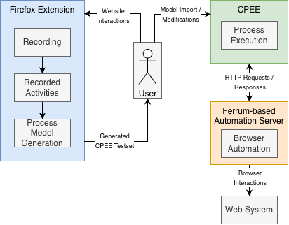
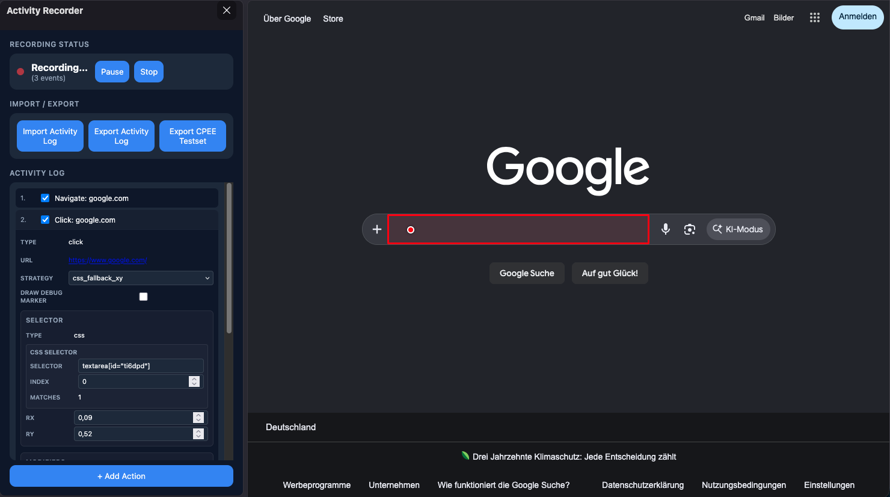
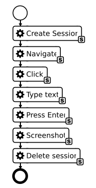

# Website Interaction Process Model Generation

Prototype developed as part of the master's thesis **"Applied Robotic Process Automation: Executable Process Model Generation from Website Interactions"** at the Technical University of Munich.

The tool records user interactions in Firefox, allows the recorded activities to be reviewed and edited, transforms selected activities into an executable CPEE testset, and executes the resulting browser activities through a Ferrum-based automation server.

## Overview

The prototype consists of two main components:

- **Firefox extension** – records and manages website interactions and generates CPEE testsets.
- **Ferrum automation server** – exposes browser automation operations through an HTTP API and executes the generated browser activities.

The generated CPEE process model sits between both components and controls the execution sequence.

<p align="center">
    
</p>

## Repository Structure

```text
.
├── firefox-extension/
│   ├── src/
│   ├── build.js
│   ├── manifest.json
│   ├── package.json
│   └── package-lock.json
│
└── ferrum-server/
    ├── lib/
    ├── routes/
    ├── server.rb
    ├── Gemfile
    └── Gemfile.lock
```

## Requirements

To run the complete prototype, you need:

- Firefox
- Node.js and npm
- Ruby and Bundler
- Google Chrome or Chromium (used by [Ferrum](https://github.com/rubycdp/ferrum) for browser automation)
- Access to a [CPEE](https://cpee.org/) instance

## 1. Set Up the Ferrum Automation Server

Open the server directory and install the Ruby dependencies:

```bash
cd ferrum-server
bundle install
```

Start the server:

```bash
bundle exec ruby server.rb
```

By default, the server listens on port `4567`.

The server provides the browser operations used by the generated CPEE activities, including navigation, text input, special keys, clicks, selections, clipboard operations, screenshots, and HTML retrieval.

### Server URL

The Firefox extension embeds the configured server URL into generated CPEE testsets.

The URL is configured in:

```text
firefox-extension/src/cpee/config.js
```

```js
export const FERRUM_SERVER_BASE_URL = "https://lehre.bpm.in.tum.de/ports/4567";
```

The value currently reflects the infrastructure used during the thesis evaluation. Change it if the automation server is hosted somewhere else.

If CPEE runs on a remote machine, the Ferrum server must be reachable from that machine. A server running only on `localhost` cannot be reached by a remote CPEE instance.

The Ferrum server also contains a `PUBLIC_BASE_URL` and a list of permitted hosts in `ferrum-server/server.rb`. Adapt these values when using a different public server address.

## 2. Build the Firefox Extension

Install the JavaScript dependencies:

```bash
cd firefox-extension
npm ci
```

Build the extension:

```bash
npm run build
```

This creates the generated files in:

```text
firefox-extension/dist/
```

The `dist` directory is intentionally not stored in the repository and must be generated before loading the extension.

## 3. Load the Extension in Firefox

1. Open Firefox.
2. Navigate to `about:debugging#/runtime/this-firefox`.
3. Select **Load Temporary Add-on**.
4. Select `firefox-extension/manifest.json`.

<p align="center">
    
</p>

Because this is loaded as a temporary extension, Firefox removes it when the browser is closed. Repeat the loading step after restarting Firefox.

## 4. Record a Website Task

Open the website containing the task you want to automate.

In the **Activity Recorder** sidebar:

1. Click **Start**.
2. Perform the desired interactions on the website.
3. Click **Pause** if the recording should be interrupted temporarily.
4. Click **Resume** to continue.
5. Click **Stop** when the demonstrated task is complete.

The recorded activities appear in the activity log in the order in which they occurred.

Automatically recorded activity types include:

- navigation
- clicks
- text input
- select operations
- special keys
- copy
- cut
- paste
- recording pauses

Users can also add the following activities manually:

- **Screenshot**
- **Get Element HTML**
- **Navigate**

## 5. Review and Edit Recorded Activities

Before generating the process model, recorded activities can be inspected and adjusted directly in the sidebar.

Depending on the activity type, editable information includes values such as:

- selectors and selector indexes
- click strategy and click position
- text input
- keyboard modifiers
- selected options
- screenshot options

To exclude an activity from the generated CPEE model, uncheck the checkbox on the left side of the corresponding activity.

For element-based interactions, the extension can highlight the currently resolved target element. This can be used to check and adjust recorded selectors before generating the CPEE model.



### Manual Activities

Click **+ Add Action** below the activity log to manually insert an additional action.

Available manual actions are:

- Screenshot
- Get Element HTML
- Navigate

For **Get Element HTML**, use **Pick Element** to select the required website element.

## 6. Import and Export Activity Logs

The sidebar provides two functions for saving and restoring recorded activity data:

- **Export Activity Log** downloads the current activity log as JSON.
- **Import Activity Log** loads a previously exported activity log.

This makes it possible to save a recording, reopen it later, modify it, and generate a process model from it.

## 7. Generate a CPEE Testset

After reviewing the activity log, click:

**Export CPEE Testset**

The extension transforms the selected activities into CPEE process activities and downloads the generated testset as an XML file.

A browser session activity is automatically inserted at the beginning of the generated process and a corresponding session termination activity is added at the end.

Recorded pauses are represented as dedicated placeholder activities. They can be replaced or removed after importing the model into CPEE.

## 8. Import the Generated Model into CPEE

Import the generated XML testset into CPEE.

The resulting process model contains the browser activities generated from the recording. It can be inspected and modified before execution and can also be extended with additional process logic.

Examples include:

- conditions and branches
- additional service calls
- processing data returned by browser activities



## 9. Execute the Process

Make sure that the Ferrum automation server is running and reachable through the URL stored in the generated CPEE testset.

Start the process in CPEE.

During execution:

1. CPEE creates a browser session through the Ferrum server.
2. The generated process activities send HTTP requests to the server.
3. Ferrum performs the corresponding interactions in the browser.
4. Results are returned to the CPEE process instance.
5. The browser session is terminated after the generated sequence is complete.

The same browser session is used throughout the generated browser activity sequence.

## Click Execution

The prototype supports three click strategies:

- **Selector-based click** – directly clicks the element identified by the recorded selector.
- **XY click** – performs a position-based click using relative coordinates.
- **Selector with XY fallback** – first attempts a selector-based click and can fall back to a position-based click.

XY positions can be stored relative to either the selected element or the browser viewport, depending on the configured interaction.

The element localization mechanism also supports traversal through nested **open Shadow DOM** structures.

## Debugging

The Ferrum server provides a session-specific debug page that can be used to inspect the current browser state and test element selectors.

Generated browser activities can also return screenshots or the HTML representation of selected elements, allowing the resulting data to be used by later CPEE process activities.

## Notes and Limitations

This repository contains a research prototype and is not intended as a production-ready browser automation platform.

Website automations depend on the structure and behavior of the target website. Changes to page structure, selectors, dynamic content, or interaction behavior can therefore require adjustments to a recorded automation.

The current element localization approach supports regular DOM elements and elements inside **open** Shadow DOM structures. Closed Shadow DOM structures are not supported by the implemented selector traversal.

Recorded activity data may contain entered or pasted text, URLs, and other interaction data. Do not record passwords or other sensitive information, and review exported activity logs before sharing them.

## Master's Thesis

This prototype was developed for:

**Julian Simon**  
_Applied Robotic Process Automation: Executable Process Model Generation from Website Interactions_  
Master's Thesis in Information Systems  
Technical University of Munich, 2026
